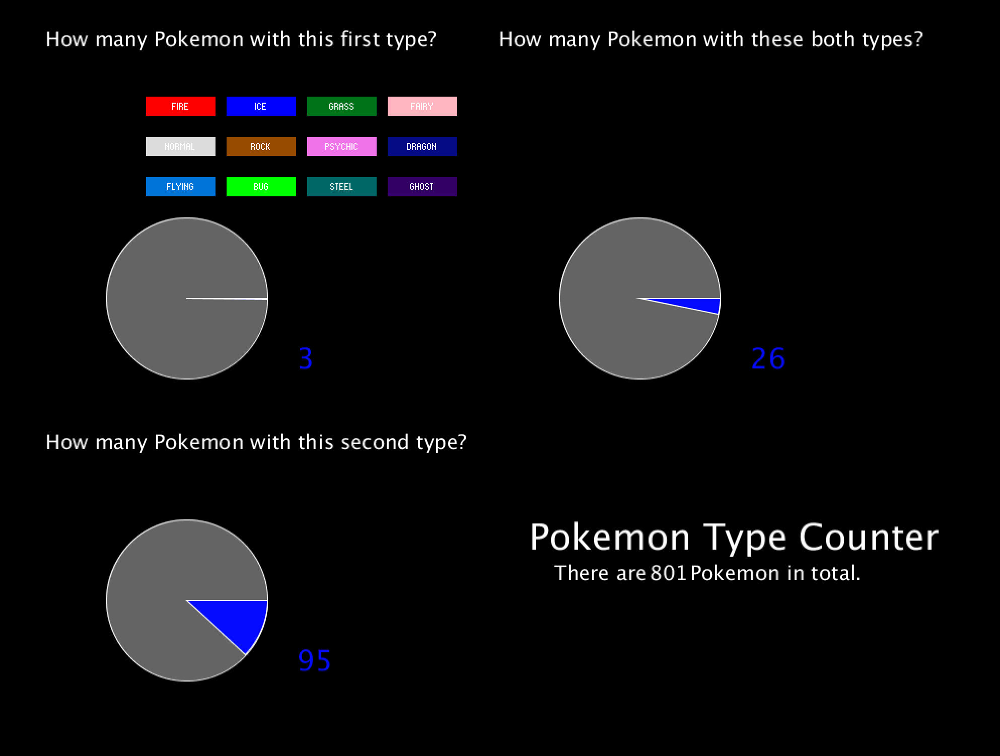

**Data Visualization Project by Nyx**

**Pokemon Types Visualizer**

I created a program that allows you to see what number and part of all Pokemon a certain type is. 
The user can select a Pokemon type from the Button Menu and then they can see how many Pokemon, have this type
at a first listed type, how many as a second and how many have the two types (currently selected and previously selected).
The data is visualized both as a number and as a PieChart.

Here is a picture of the program:

  

And here is a [video](https://youtu.be/irJij-IUNDw) of it. 

Credit to [ControlP5](http://www.sojamo.de/libraries/controlP5/), a library written by Andreas Schlegel. 
And also to [Rouna Kbanik](https://www.kaggle.com/rounakbanik/pokemon), whose Pokemon data set I used. 

Issues: 

1. A pie chart is bad for representing such small numbers. But it was too late when I figured out that there are only a few Pokemon from each type.

2. The titles are outside of the translation because otherwise they change color. 
