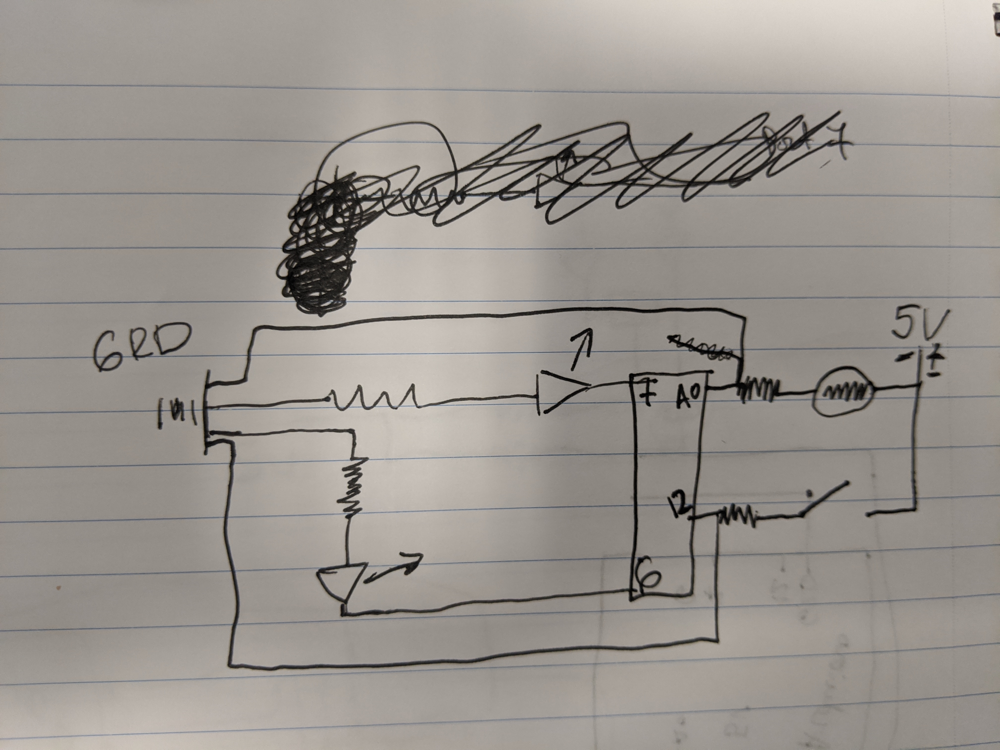

*Emergcency SOS Switch*

This week I decided to modify my last week’s circuit and add another feature to it. It still reacts to the increase of light to the photo resistor and it turns off the LEDs. However, if now the sensor stops receiving any light, irrespective of the switch state one of the LEDs will begin sending the SOS signal in Mores code. This is the so called emergency state of my circuit. 

Circuit: 

  

[Video](https://youtu.be/bI--KfcfLaI)

Issues:

1. I got used to using the photoresistor values with the actual values and translating it into mapped values took some tests. 
2. I am bad at drawing, like really really bad... I am also aware the ports that I have drawn on my circuit schematic are not on the same sides on the Arduino. I hope it is not a problem, if it is I can fix it probably, but with a few more attempts at this drawing. 
